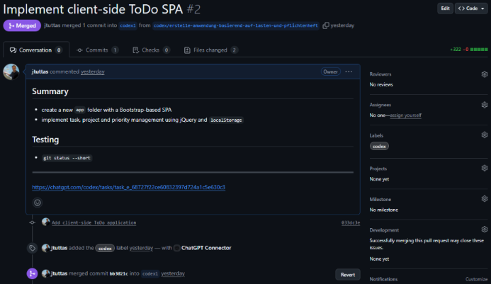
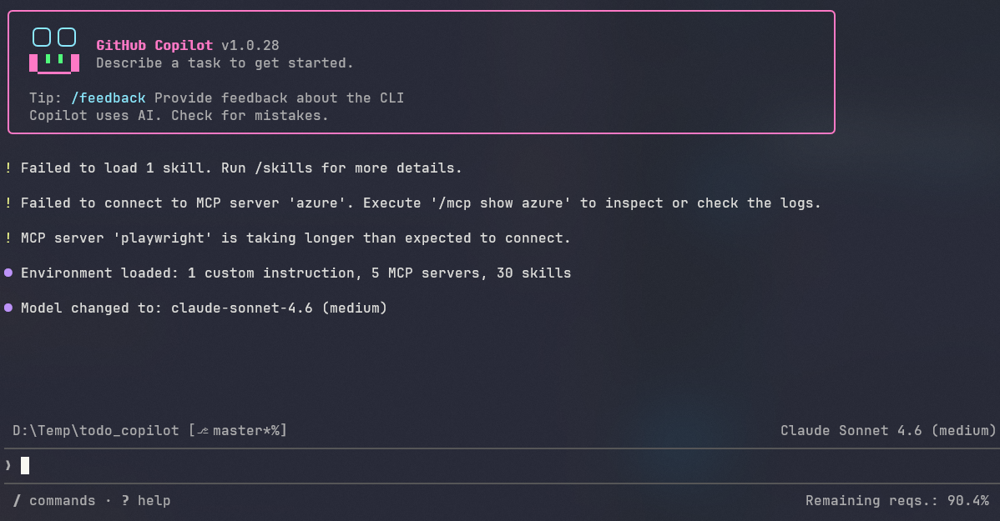
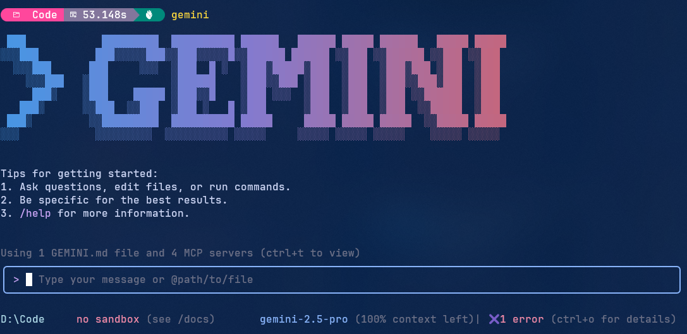
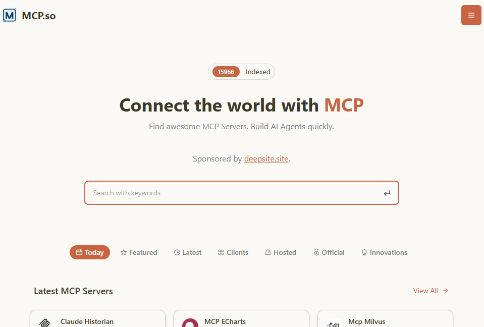

# KI unterstützte Softwareentwicklung

### von und mit Jörg Tuttas

---

<!-- header: KI unterstützte Softwareentwicklung  -->


> KI wird Sie nicht ersetzen, aber Entwickler, die KI nutzen, werden Entwickler ersetzen, die es nicht tun.

---


# Kurzvorstellung

- was erwarte ich von dieser Veranstaltung
- welche Vorerfahrungen bringe ich mit
- In welchem Bereich bin ich tätig und welche Programmiersprachen setze ich ein
- "dieses wird eine gute Veranstaltung, wenn..."

---


- ChatGPT im Canvas Mode
- v0.dev - Rapid Prototyping
- Github CoPilot - Autocompletion
- Agenten (github Copilot, Codex, Gemini)
- MCP - Model Context Protocol

---


# Workshop am Nachmittag

- Praktische Übungen zu den vorgestellten Tools
- Gemeinsame Entwicklung von Prototypen
- Erfahrungsaustausch und Best Practices

---

# Abschluss


- Diskussion, Feedback und offene Fragen
- Ausblick auf zukünftige Entwicklungen in der KI-unterstützten Softwareentwicklung
- Welche Kompetenzen sind in Zukunft wichtig?

---


# ChatGPT

> Erstelle mit die Klasse Person.java mit den Attributen "sex" und "dayOfBirth" sowie der Methode getAge():int

<!-- footer: 30. Nov. 2022 -->

---


# Canvas Mode in ChatGPT

> Erstelle mir für ein Kassensystem die Klassen "Artikel.java", "Position.java" und "Warenkorb.java" mit den Attributen und Methoden, die du für notwendig hältst. Achte darauf, dass die Klassen gut strukturiert sind und eine klare Trennung der Verantwortlichkeiten haben.

Codereview, übersetzen in andere Sprachen u.v.a.m 

<!-- footer: Oktober 2024 -->

---


# v0.dev - Rapid Prototyping

> Erstelle mir einen einfachen Taschenrechner in React. 

Inkl. Deployment auf Vercel

<!-- footer: April 2024 -->

---


# github Copilot

- Autocompletion
- Code Review / Code erklären
- Kommentare generieren
- Programmieren über Kommentare
- Commit Nachrichten generieren

<!-- footer: 2022 - 2024 -->

---


# Agenten

- Codex (OpenAI)
- github Copilot (Microsoft)
- Gemini (Google)

<!-- footer: 2025 -->

---


## Codex der Agent in der Cloud



<!-- footer: 2025 -->

---


## Github Pages auf dev-branch

> Erstelle anhand von Lastenheft.md und Pflichtenheft-Bootstap.md die Anwendung !

<https://jtuttas.github.io/Softwareentwicklung_KI/>

<!-- footer: 2025 -->

---


## CoPilot im Agent Mode



<!-- footer: 2025 -->
---


## Gemini CLI der Agent im Terminal



<!-- footer: 2025 -->

---


## Gemini CLI installieren

> node.js muss installiert sein <https://nodejs.org/en/download>

anschließend in der Konsole:

```bash
npm install -g gemini-cli
```

<!-- footer: 2025 -->

---


## Repository zum Workshop

Clonen Sie sich das folgende Repository:

```bash
git clone https://github.com/jtuttas/Softwareentwicklung_KI
```

<!-- footer: 2025 -->

---


## MCP - Model Context Protocol

> Die KI Agenten bekommen Werkzeuge

<!-- footer: Nov. 2024 -->
---


## MCP Server Datenbank



<!-- footer: 2025 -->

---

# Evaluation


<!-- footer: Bitte nehmen Sie an der Umfrage teil -->