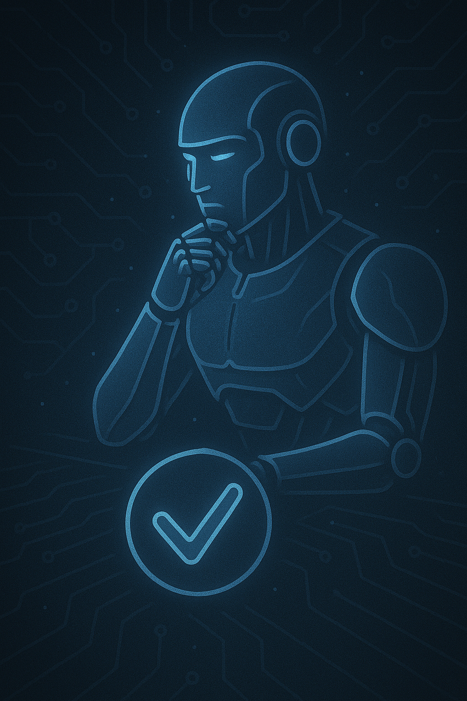

# KI unterstützte Softwareentwicklung

### von und mit Jörg Tuttas

---

> KI wird Sie nicht ersetzen, aber Entwickler, die KI nutzen, werden Entwickler ersetzen, die es nicht tun.

---

# Kurzvorstellung

- was erwarte ich von dieser Veranstaltung
- welche Vorerfahrungen bringe ich mit
- In welchem Bereich bin ich tätig und welche Programmiersprachen setze ich ein
- "dieses wird eine gute Veranstaltung, wenn..."

---

- ChatGPT im Canvas Mode
- v0.dev - Rapid Prototyping
- Github CoPilot - Autocompletion
- Agenten (github Copilot, Gemini)
- MCP - Model Context Protocol

---

# Workshop am Nachmittag

- Praktische Übungen zu den vorgestellten Tools
- Gemeinsame Entwicklung von Prototypen
- Erfahrungsaustausch und Best Practices

---

# Abschluss

- Zusammenfassung der wichtigsten Konzepte
- Diskussion, Feedback und offene Fragen
- Ausblick auf zukünftige Entwicklungen in der KI-unterstützten Softwareentwicklung

