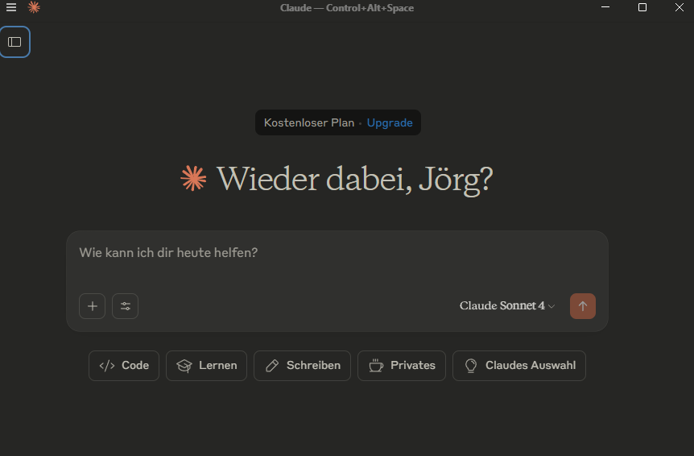
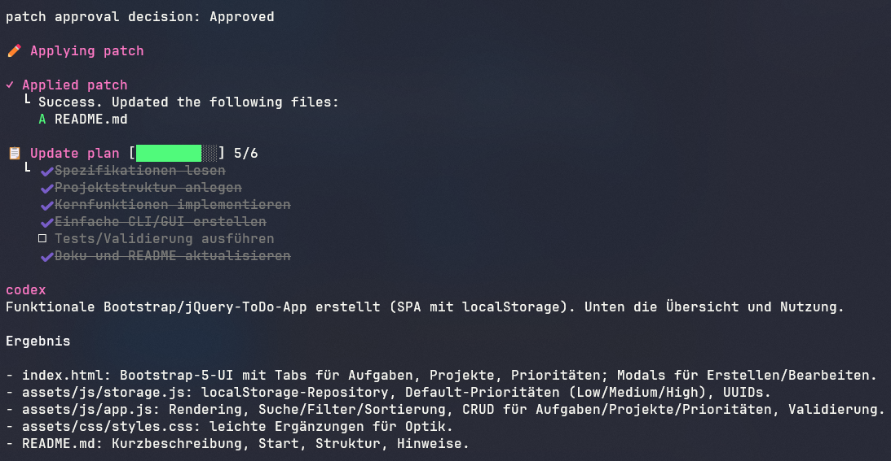
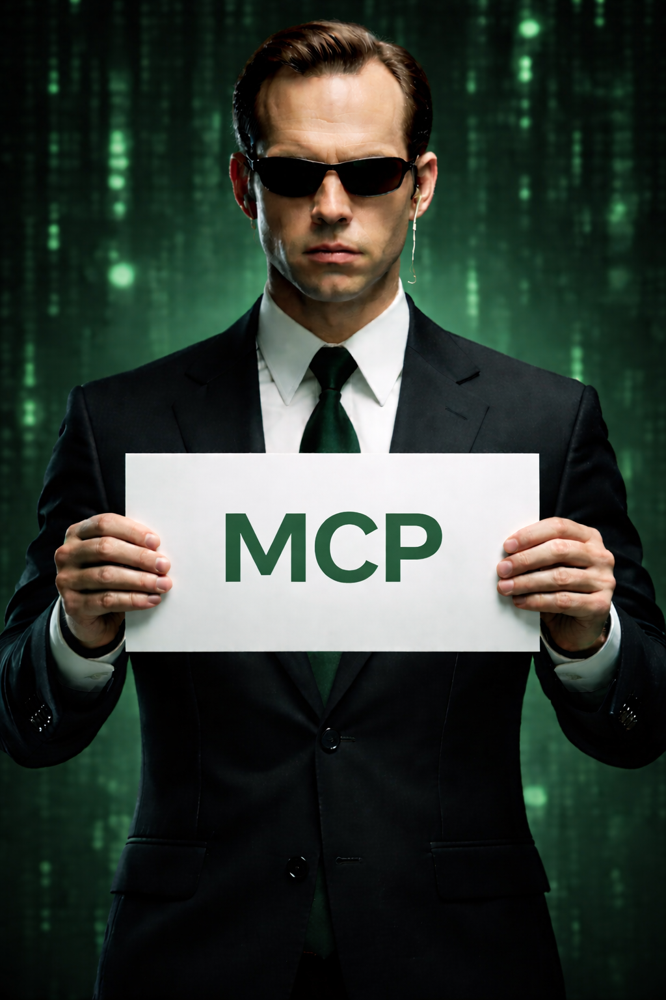

<!-- header: Nationaler Cisco Akademien Tage 2026  -->


# Agenten getriebene Softwareentwicklung

#### von und mit Jörg Tuttas

Leiter des Bildungsgangs f. Fachinformatiker Anwendungsentwicklung

#### MMBbS Hannover

---


> KI wird Sie nicht ersetzen, aber Entwickler, die KI nutzen, werden Entwickler ersetzen, die es nicht tun.

---


- Überblick Agenten (github Copilot, Codex, **Gemini**, Claude Desktop)
- Workshop: Erstellen einer App mit Agenten
- MCP - Model Context Protocol


---


# Agenten

> Agenten haben einen Auftrag und nutzen Werkzeuge, um diesen Auftrag zu erfüllen.


---


# Bekannte Agenten:

- Claude Desktop / CLI (Anthropic)
- Codex Web/CLI (OpenAI)
- github Copilot / CLI (Microsoft)
- Gemini (Google)


---


## Claude Desktop (Anthropic)



<!-- https://www.qrcode-monkey.com/ -->


---


### Codex Web der Agent in der Cloud

<https://jtuttas.github.io/codextest/>


<!-- Am besten den main Branch im  https://github.com/jtuttas/codextest Repository wählen, da hier Github Pages aktiviert ist über <https://jtuttas.github.io/codextest/> -->


---


## CoPilot im Agent Mode


---


## Gemini CLI der Agent von Google im Terminal


---


## Codex CLI der Agent von OpenAI im Terminal




---


## Gemini CLI installieren

> node.js muss installiert sein <https://nodejs.org/en/download>

## anschließend in der Konsole:

```bash
npm install -g @google/gemini-cli
```


---


## Repository zum Workshop

Clonen Sie sich das folgende Repository:

```bash 
git clone https://github.com/jtuttas/Softwareentwicklung_KI
```


---


## Die wichtigstens Dateien im Repository

- PRD.md - Produkt Requirements Document, das Lastenheft der Anwendung
- SRS.md - Software Requirements Specification, das Pflichtenheft der Anwendung
- AGENT.md - Beschreibung der Agenten


---


# Prompt

Starten Sie den Gemini Agenten und nutzen Sie folgenden Prompt:

```txt
Erstelle mir die Anwendung wie in den Anforderungen beschrieben
```


---


## MCP - Model Context Protocol

> Die KI Agenten bekommen Werkzeuge


---



Über /mcp können die unterschiedlichen MCP Server und deren Tools angezeigt werden

# Prompt

```txt
Erstelle eine README.md mit Screenshots der Anwendung
```


---


Im Projekt enthalten ist auch ein Azure MCP Server.

# Prompt

```txt
Veröffentliche mir die Anwendung auf Azure nutze Azure MCP 
```


---


## MCP Server Datenbank


---


## Was bleibt?

- Wie kann dis Ausbildung zum Fachinformatiker auf diese Entwicklung reagieren?
- Welche Kompetenzen brauchen Entwickler in der Zukunft?


