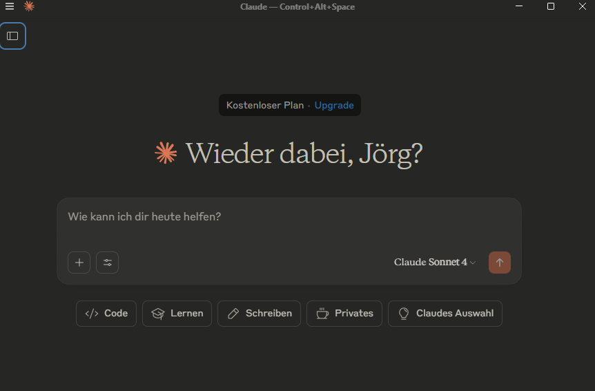
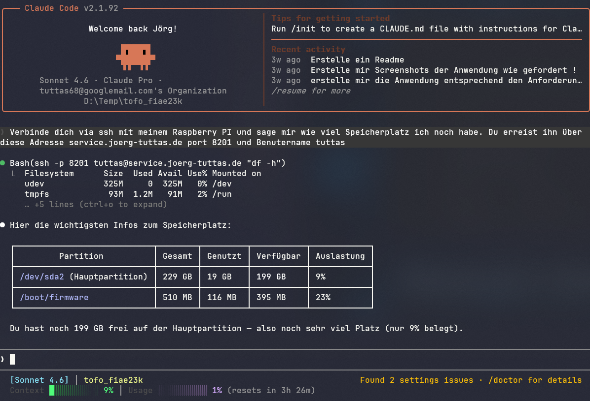
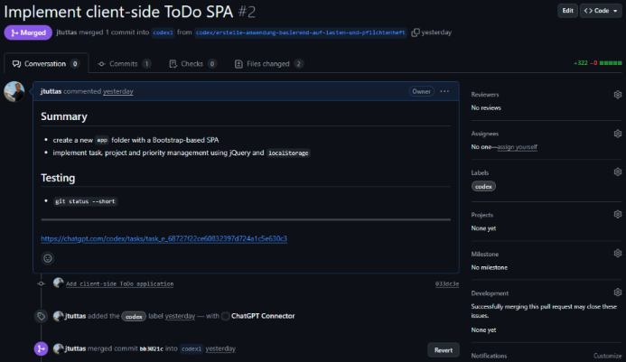
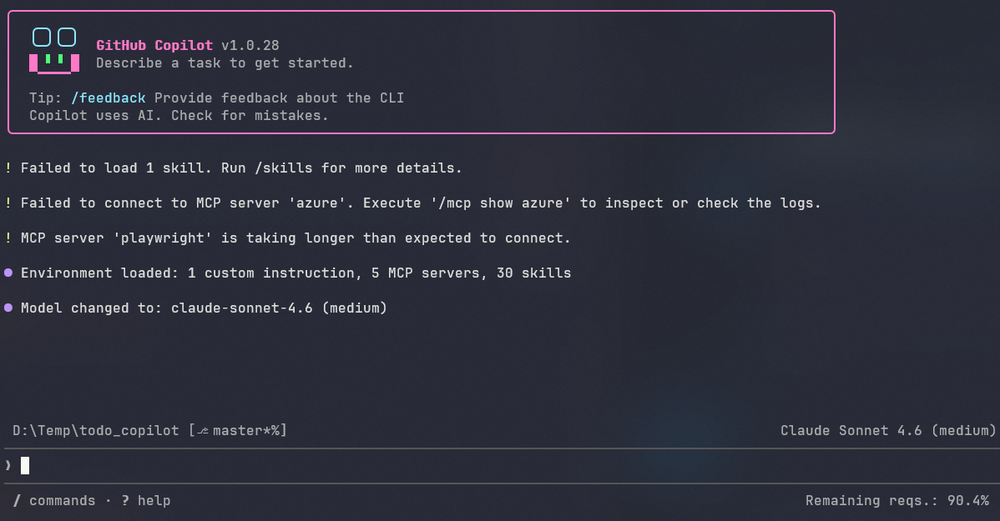
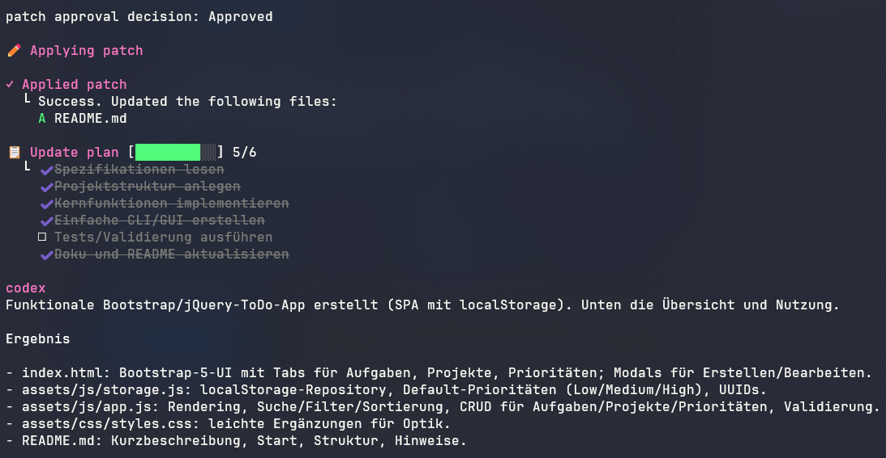
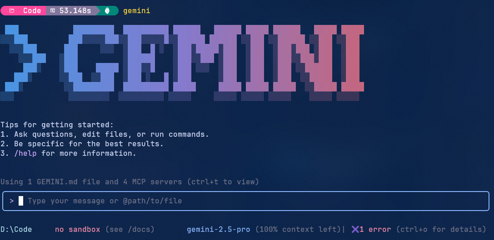
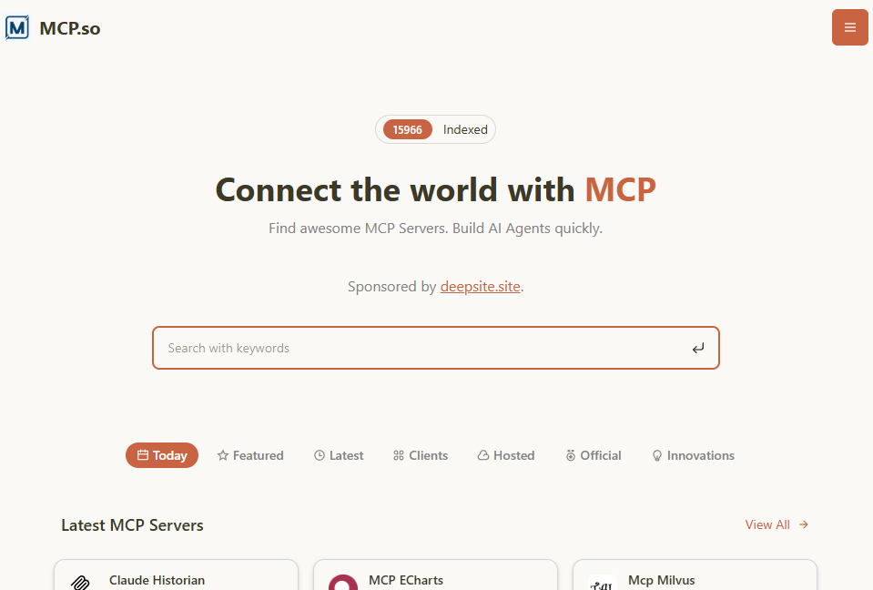

<!-- header: Nationaler Cisco Akademien Tage 2026  -->


# Agenten getriebene Softwareentwicklung

#### von und mit Jörg Tuttas

Leiter des Bildungsgangs f. Fachinformatiker Anwendungsentwicklung

#### MMBbS Hannover

---


> KI wird Sie nicht ersetzen, aber Entwickler, die KI nutzen, werden Entwickler ersetzen, die es nicht tun.

---


- Überblick aktuelle Agenten (**github Copilot**, Codex, Gemini CLI, Claude *Desktop/CLI*)
- Workshop: Erstellen einer App mit Agenten
- MCP - Model Context Protocol


---


# Agenten

> Agenten haben einen Auftrag und nutzen Werkzeuge, um diesen Auftrag zu erfüllen.


---


# Bekannte Agenten:

- Claude Desktop / CLI (Anthropic)
- Codex Web/CLI (OpenAI)
- github Copilot / CLI (Microsoft)
- Gemini CLI (Google)


---


## Claude Desktop (Anthropic)



<!-- https://www.qrcode-monkey.com/ -->


---


## Claude Code (Anthropic)



<!-- https://www.qrcode-monkey.com/ -->


---


### Codex Web der Agent in der Cloud

<https://jtuttas.github.io/codextest/>



<!-- Am besten den main Branch im  https://github.com/jtuttas/codextest Repository wählen, da hier Github Pages aktiviert ist über <https://jtuttas.github.io/codextest/> -->


---


## Github Copilot CLI 




---


## Codex CLI der Agent von OpenAI im Terminal




---


## Gemini CLI der Agent von google im Terminal




---


## Github Copilot CLI installieren

> node.js muss installiert sein <https://nodejs.org/en/download>

## anschließend in der Konsole:

```bash
npm install -g @github/copilot

```


---


## Repository zum Workshop

Clonen Sie sich das folgende Repository:

```bash 
git clone https://github.com/jtuttas/Softwareentwicklung_KI
```


---


## Die wichtigsten Dateien im Repository

- PRD.md - Produkt Requirements Document, das Lastenheft der Anwendung
- SRS.md - Software Requirements Specification, das Pflichtenheft der Anwendung
- AGENTS.md - Beschreibung für den Agenten


---


# Prompt

Starten Sie den Github Copilot via **copilot** und nutzen Sie folgenden Prompt:

```txt
Erstelle mir die Anwendung wie in den Anforderungen beschrieben
```

---


# Skills

Skills sind klar abgegrenzte Fähigkeiten oder Bausteine, mit denen ein KI-Agent bestimmte Aufgaben zuverlässig ausführen kann.

```txt
Erstelle mir eine IHK Projektdokumentation für die Anwendung wie in den Anforderungen beschrieben
```

---


## MCP - Model Context Protocol

> Die KI Agenten bekommen Werkzeuge


---


## Architektur MCP


---


Über /mcp können die unterschiedlichen MCP Server und deren Tools angezeigt werden

# Prompt

```txt
Ergänze die Benutzeranleitung.md um Screenshots der Anwendung, 
nutze Playwright MCP Server um die Screenshots zu erstellen
```


---


Im Projekt enthalten ist auch ein Azure MCP Server.

# Prompt

```txt
Veröffentliche mir die Anwendung auf Azure nutze Azure MCP 
```

<small style="position:absolute;bottom:30px;color:#888">¹ Sofern Sie über die notwendigen Berechtigungen verfügen</small>

---


## MCP Server Datenbank



---


## Was bleibt?

- Wie kann dis Ausbildung zum Fachinformatiker auf diese Entwicklung reagieren?
- Welche Kompetenzen brauchen Entwickler in der Zukunft?


