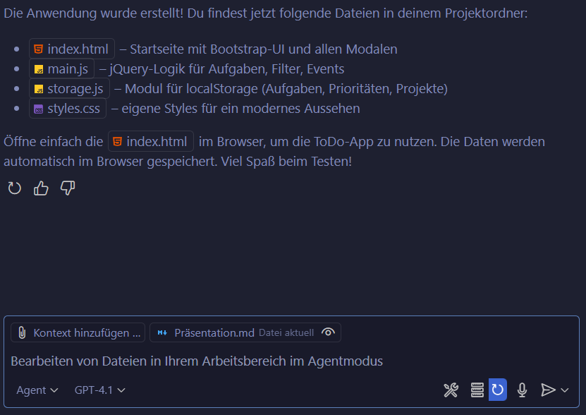
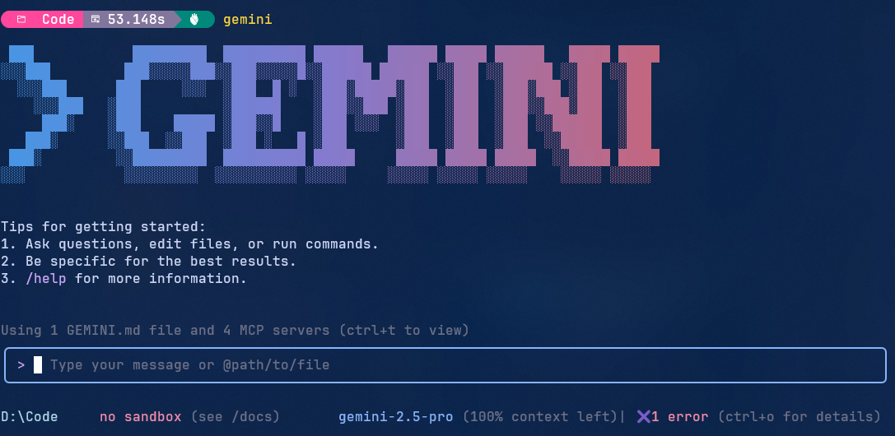

<!-- header: Nationale Cisco Akademien Tage 2026  -->


# Agenten getriebene Softwareentwicklung

#### von und mit Jörg Tuttas

Leiter des Bildungsgangs f. Fachinformatiker Anwendungsentwicklung

#### MMBbS Hannover

---


> KI wird Sie nicht ersetzen, aber Entwickler, die KI nutzen, werden Entwickler ersetzen, die es nicht tun.

---


- Überblick Agenten (github Copilot, Codex, **Gemini**, Claude Desktop)
- Workshop: Erstellen einer App mit Agenten
- MCP - Model Context Protocol


---


# Agenten

> Agenten haben einen Auftrag und nutzen Werkzeuge, um diesen Auftrag zu erfüllen.


---


# Bekannte Agenten:

- Claude Desktop / CLI (Anthropic)
- Codex Web/CLI (OpenAI)
- github Copilot / CLI (Microsoft)
- Gemini (Google)


---


## Claude Desktop (Anthropic)


<!-- https://www.qrcode-monkey.com/ -->

<!-- footer: 2025 -->

---


### Codex Web der Agent in der Cloud

<https://jtuttas.github.io/codextest/>


<!-- Am besten den main Branch im  https://github.com/jtuttas/codextest Repository wählen, da hier Github Pages aktiviert ist über <https://jtuttas.github.io/codextest/> -->

<!-- footer: 2025 -->

---


## CoPilot im Agent Mode



<!-- footer: 2025 -->
---


## Gemini CLI der Agent von Google im Terminal



<!-- footer: 2025 -->

---


## Codex CLI der Agent von OpenAI im Terminal


<!-- footer: 2025 -->

---


## Gemini CLI installieren

> node.js muss installiert sein <https://nodejs.org/en/download>

## anschließend in der Konsole:

```bash
npm install -g @google/gemini-cli
```

<!-- footer: 2025 -->

---


## Repository zum Workshop

Clonen Sie sich das folgende Repository:

```bash 
git clone https://github.com/jtuttas/Softwareentwicklung_KI
```

<!-- footer: 2025 -->
---


## Die wichtigstens Dateien im Repository

- PRD.md - Produkt Requirements Document, das Lastenheft der Anwendung
- SRS.md - Software Requirements Specification, das Pflichtenheft der Anwendung
- AGENT.md - Beschreibung der Agenten

<!-- footer: 2025 -->

---


## Prompt

Starten Sie den Gemini Agenten und nutzen Sie folgenden Prompt:

```txt
"Erstelle mir die Anwendung wie in den Anforderungen beschrieben"
```


<!-- footer: 2025 -->

---


## MCP - Model Context Protocol

> Die KI Agenten bekommen Werkzeuge

<!-- footer: Nov. 2024 -->
---


## MCP Server Datenbank


<!-- footer: 2025 -->

