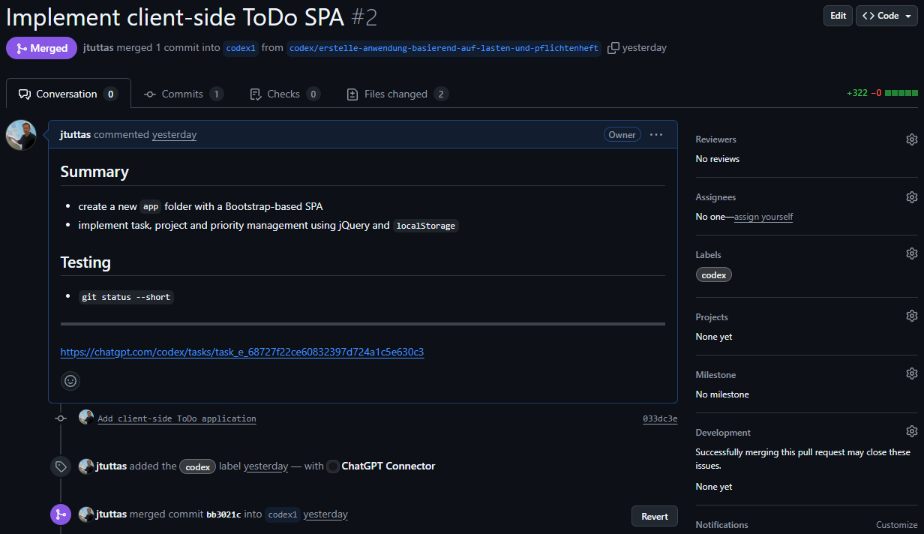

<!-- header: Niedersächsische Cisco Akademien Tage 2025  -->


# KI unterstützte Softwareentwicklung

### von und mit Jörg Tuttas

---


> KI wird Sie nicht ersetzen, aber Entwickler, die KI nutzen, werden Entwickler ersetzen, die es nicht tun.

---


- Agenten (github Copilot, Codex, **Gemini**)
- MCP - Model Context Protocol


---


# Agenten

- Codex (OpenAI)
- github Copilot (Microsoft)
- Gemini (Google)

<!-- footer: 2025 -->

---


## Codex der Agent in der Cloud



<!-- footer: 2025 -->

---


## CoPilot im Agent Mode


<!-- footer: 2025 -->
---


## Gemini CLI der Agent im Terminal


<!-- footer: 2025 -->

---


## Gemini CLI installieren

> node.js muss installiert sein <https://nodejs.org/en/download>

anschließend in der Konsole:

```bash
npm install -g gemini-cli
```

<!-- footer: 2025 -->

---


## Repository zum Workshop

Clonen Sie sich das folgende Repository:

```bash 
git clone https://github.com/jtuttas/Softwareentwicklung_KI
```

<!-- footer: 2025 -->

---


## MCP - Model Context Protocol

> Die KI Agenten bekommen Werkzeuge

<!-- footer: Nov. 2024 -->
---


## MCP Server Datenbank


<!-- footer: 2025 -->

